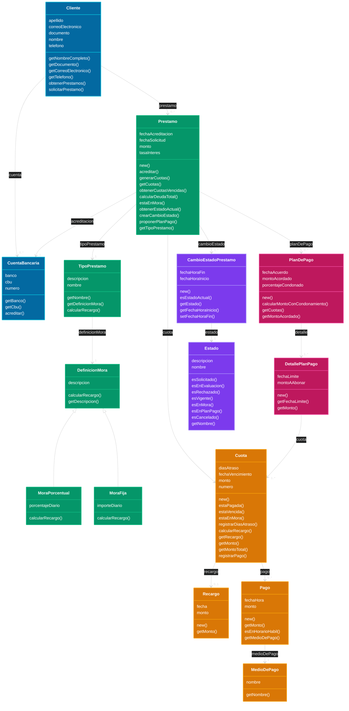

# Modelo de Dominio - CreditIn (Gestión de Préstamos)

> Diagrama de clases del dominio para el caso de estudio *DSI 2026 Parcial 1 - CreditIn*.
> Nomenclatura y estilo según la cátedra (atributos + métodos, clase `Estado` como objeto,
> historial de estados vía `CambioEstadoPrestamo`, jerarquía de `DefinicionMora`, asociaciones
> nombradas con multiplicidades). Este es el modelo "completo" que el día del parcial se acota al CU dado.

## Decisiones de modelado (justificación según el enunciado)

| Elemento | Justificación (texto del caso) |
|---|---|
| **Cliente 1 — 0..\* Préstamo** | "Un mismo cliente puede poseer múltiples préstamos asociados a lo largo del tiempo y de manera simultánea." |
| **TipoPrestamo** | "Existen distintos tipos de préstamos… Cada tipo de préstamo define un conjunto de características generales" (personal, hipotecario, prendario, corto/largo plazo). |
| **DefinicionMora** abstracta con **MoraPorcentual / MoraFija** | "Según el tipo de préstamo, existe una definición de mora… las reglas mediante las cuales se calcularán los recargos." Los dos ejemplos (2% diario vs $500 fijo por día) son subtipos con distinto `calcularRecargo()` → polimorfismo. Una `DefinicionMora` por `TipoPrestamo`. |
| **Cuota** con `diasAtraso` | "Las cuotas constituyen las obligaciones de pago… Para aquellas cuotas que no hayan sido abonadas en término se registra la cantidad de días de atraso." |
| **Recargo** (0..1 por Cuota) | "El recargo representa el resultado concreto de aplicar las reglas definidas por la definición de mora sobre una cuota determinada." |
| **Pago → 1 MedioDePago** | "Cada pago efectuado por un cliente corresponde a una cuota específica y se realiza mediante un único medio de pago" (transferencia, tarjeta). `esEnHorarioHabil()` refleja "días hábiles, de 9 a 20 hs". |
| **PlanDePago** con `porcentajeCondonado` y **DetallePlanPago** (fechaLimite + monto, agrupa 1..\* cuotas) | "El plan establece qué cuotas… forman parte del acuerdo, el monto a abonar y las fechas límite… puede establecer que en una fecha determinada se cancelen dos cuotas en conjunto." Condonamiento = reducción de intereses. |
| **Estado** + **CambioEstadoPrestamo** | Patrón de la cátedra (igual que `CambioEstadoVuelo` en Líneas Aéreas): el préstamo pasa por Solicitado → En Evaluación → Rechazado / Vigente → En Mora → En Plan de Pago → Cancelado. Permite construir la máquina de estados del Préstamo y conservar el historial. |
| **CuentaBancaria** | "En caso positivo, el préstamo será acreditado en la cuenta bancaria del cliente" + glosario *Acreditación*. |

### Supuestos / puntos a confirmar el día del parcial
- **Equipo financiero** que evalúa el historial crediticio se tomó como **actor** (rol externo), no como clase del dominio. Si el CU pide registrar la evaluación, se agregaría `EvaluacionCrediticia { fecha, resultado, factible }` asociada a `Prestamo 1 — 0..1`.
- La **máquina de estados** del parcial probablemente sea sobre `Prestamo` (o `Cuota`). El modelo soporta ambas: `Prestamo` vía `Estado/CambioEstadoPrestamo`; `Cuota` vía métodos `estaPagada()/estaVencida()/estaEnMora()`.
- `tasaInteres` se ubicó en `Prestamo` (podría moverse a `TipoPrestamo` si el CU lo trata como condición general del tipo).
