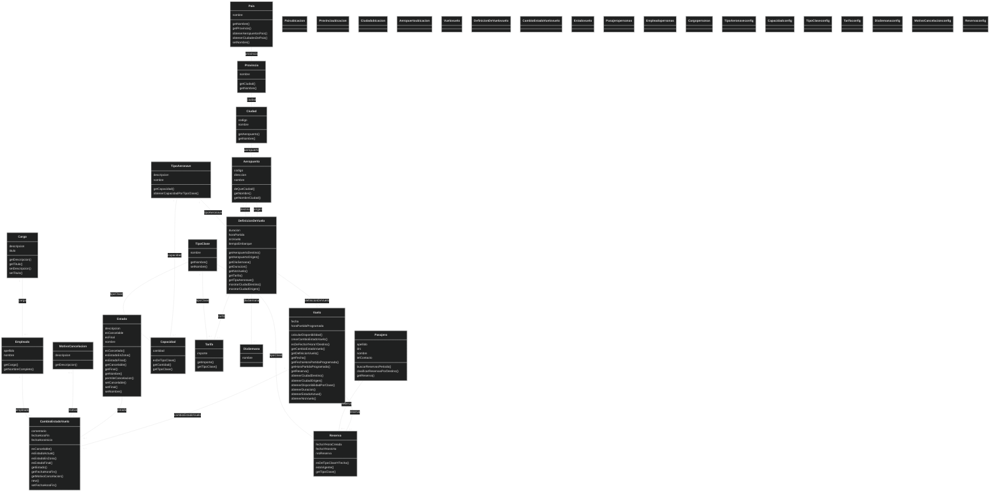

# Modelo de Dominio - Líneas Aéreas

```mermaid
%%{init: {'theme': 'dark', 'themeVariables': { 'darkMode': 'true', 'primaryColor': '#1e3a8a', 'primaryBorderColor': '#3b82f6', 'textColor': '#ffffff', 'tertiaryColor': '#10b981'}}}%%
classDiagram

class Pais {
  nombre
  getNombre()
  getProvincia()
  obtenerAeropuertosPais()
  obtenerCiudadesDePais()
  setNombre()
}

class Provincia {
  nombre
  getCiudad()
  getNombre()
}

class Ciudad {
  codigo
  nombre
  getAeropuerto()
  getNombre()
}

class Aeropuerto {
  codigo
  direccion
  nombre
  deQueCiudad()
  getNombre()
  getNombreCiudad()
}

class Estado {
  descripcion
  esCancelable
  esFinal
  nombre
  esCancelado()
  esEstadoEnZona()
  esEstadoFinal()
  getCancelable()
  getFinal()
  getNombre()
  permiteCancelacion()
  setCancelable()
  setFinal()
  setNombre()
}

class MotivoCancelacion {
  descripcion
  getDescripcion()
}

class CambioEstadoVuelo {
  comentario
  fechaHoraFin
  fechaHoraInicio
  esCancelable()
  esEstadoActual()
  esEstadoEnZona()
  esEstadoFinal()
  getEstado()
  getFechaHoraFin()
  getMotivoCancelacion()
  new()
  setFechaHoraFin()
}

class Cargo {
  descripcion
  titulo
  getDescripcion()
  getTitulo()
  setDescripcion()
  setTitulo()
}

class Empleado {
  apellido
  nombre
  getCargo()
  getNombreCompleto()
}

class TipoAeronave {
  descripcion
  nombre
  getCapacidad()
  obtenerCapacidadPorTipoClase()
}

class Capacidad {
  cantidad
  esDeTipoClase()
  getCantidad()
  getTipoClase()
}

class Tarifa {
  importe
  getImporte()
  getTipoClase()
}

class TipoClase {
  nombre
  getNombre()
  setNombre()
}

class DiaSemana {
  nombre
}

class DefinicionDeVuelo {
  duracion
  horaPartida
  nroVuelo
  tiempoEmbarque
  getAeropuertoDestino()
  getAeropuertoOrigen()
  getDiaSemana()
  getDuracion()
  getNroVuelo()
  getTarifa()
  getTipoAeronave()
  mostrarCiudadDestino()
  mostrarCiudadOrigen()
}

class Vuelo {
  fecha
  horaPartidaProgramada
  calcularDisponibilidad()
  crearCambioEstadoVuelo()
  esDeFechaYHoraYDestino()
  getCambioEstadoVuelo()
  getDefinicionVuelo()
  getFecha()
  getFechaHoraPartidaProgramada()
  getHoraPartidaProgramada()
  getReserva()
  obtenerCiudadDestino()
  obtenerCiudadOrigen()
  obtenerDisponibilidadPorClase()
  obtenerDuracion()
  obtenerEstadoActual()
  obtenerNroVuelo()
}

class Reserva {
  fechaYHoraCreada
  fechaYHoraVto
  nroReserva
  esDeTipoClaseYFecha()
  estaVigente()
  getTipoClase()
}

class Pasajero {
  apellido
  dni
  nombre
  telContacto
  buscarReservasPeriodo()
  clasificarReservasPorDestino()
  getReserva()
}

Pais "1" -- "1..*" Provincia : provincia
Provincia "1" -- "1..*" Ciudad : ciudad
Ciudad "1" -- "0..*" Aeropuerto : aeropuerto

Aeropuerto "1" -- "0..*" DefinicionDeVuelo : origen
Aeropuerto "1" -- "0..*" DefinicionDeVuelo : destino

TipoAeronave "1" -- "0..*" DefinicionDeVuelo : tipoAeronave
TipoAeronave "1" -- "1..*" Capacidad : capacidad
TipoClase "1" -- "0..*" Capacidad : tipoClase

DefinicionDeVuelo "1" -- "1..*" Tarifa : tarifa
TipoClase "1" -- "0..*" Tarifa : tipoClase

DefinicionDeVuelo "1" -- "1..*" DiaSemana : diaSemana
DefinicionDeVuelo "1" -- "0..*" Vuelo : definicionDeVuelo

Vuelo "1" -- "1..*" CambioEstadoVuelo : cambioEstadoVuelo
Estado "1" -- "0..*" CambioEstadoVuelo : estado
MotivoCancelacion "0..1" -- "0..*" CambioEstadoVuelo : motivo
Empleado "1" -- "0..*" CambioEstadoVuelo : empleado
Cargo "1" -- "0..*" Empleado : cargo

Vuelo "1" -- "0..*" Reserva : reserva
Pasajero "1" -- "0..*" Reserva : reserva
TipoClase "1" -- "0..*" Reserva : tipoClase

classDef ubicacion fill:#0369a1,stroke:#06b6d4,stroke-width:2px,color:#ffffff
classDef vuelo fill:#059669,stroke:#10b981,stroke-width:2px,color:#ffffff
classDef personas fill:#d97706,stroke:#f59e0b,stroke-width:2px,color:#ffffff
classDef config fill:#7c3aed,stroke:#a78bfa,stroke-width:2px,color:#ffffff
class Pais ubicacion
class Provincia ubicacion
class Ciudad ubicacion
class Aeropuerto ubicacion
class Vuelo vuelo
class DefinicionDeVuelo vuelo
class CambioEstadoVuelo vuelo
class Estado vuelo
class Pasajero personas
class Empleado personas
class Cargo personas
class TipoAeronave config
class Capacidad config
class TipoClase config
class Tarifa config
class DiaSemana config
class MotivoCancelacion config
class Reserva config
```
